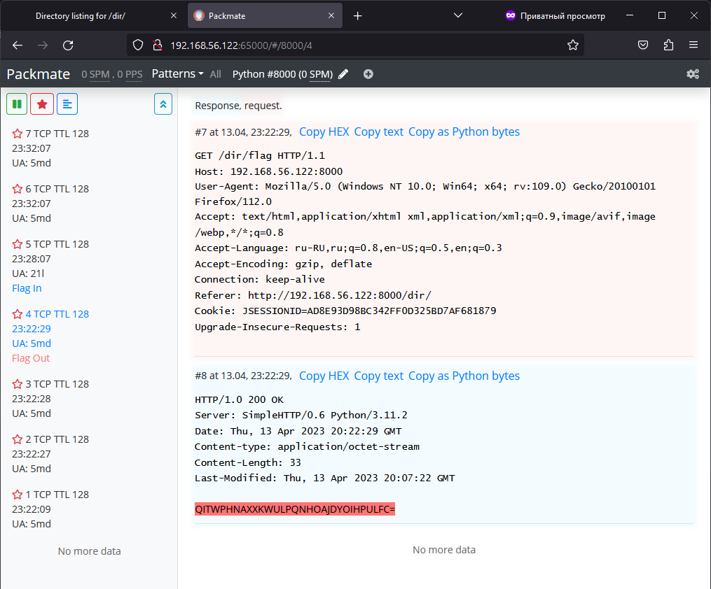

<div align="center">

# Packmate
</div>

### [[EN](README_EN.md) | RU]
Утилита перехвата и анализа трафика для CTF.

#### Фичи:
* Поддерживает перехват живого трафика и обработку pcap файлов
* Поддерживает текстовые и бинарные сервисы
* Умеет отображать совпадения паттернов в пакетах цветом
  * Подстрока
  * Регулярное выражение
  * Бинарная подстрока
* Умеет автоматически удалять стримы с определенным контентом, которые не нужно отображать
* Умеет сохранять стримы в избранное и отображать только избранные стримы
* Работает с несколькими сервисами на разных портах, может отображать стримы для конкретных сервисов и паттернов
* Поддерживает навигацию по стримам с помощью горячих клавиш
* Позволяет копировать содержимое пакета в нужном формате
* Конкатенирует смежные пакеты
* Автоматически проводит urldecode
* Разархивирует GZIP в HTTP на лету
* Разархивирует сжатые WebSockets
* Расшифровывает TLS на RSA при наличии приватного ключа



## Быстрый запуск
Для быстрого запуска Packmate следует использовать [этот стартер](https://gitlab.com/packmate/starter/-/blob/master/README.md).

## Полный запуск
Ниже следует инструкция для тех, кто хочет собрать Packmate самостоятельно.

### Клонирование
Поскольку этот репозиторий содержит фронтенд как git submodule, его необходимо клонировать так:
```bash
git clone --recurse-submodules https://gitlab.com/packmate/Packmate.git

# Или, на старых версиях git
git clone --recursive https://gitlab.com/packmate/Packmate.git
```

Если репозиторий уже был склонирован без подмодулей, необходимо выполнить:
```bash
git pull  # Забираем свежую версию мастер-репы из gitlab
git submodule update --init --recursive
```

### Настройка
[Инструкция](docs/SETUP.md)

### Запуск
После указания нужных настроек в env-файле, можно запустить приложение:
```bash
sudo docker compose up --build -d
```

При успешном запуске Packmate будет видно с любого хоста на порту `65000`.
БД будет слушать на порту 65001, но будет разрешать подключения только с localhost.

## Использование
[Инструкция](docs/USAGE.md)

<div align="right">

*desu~*
</div>
