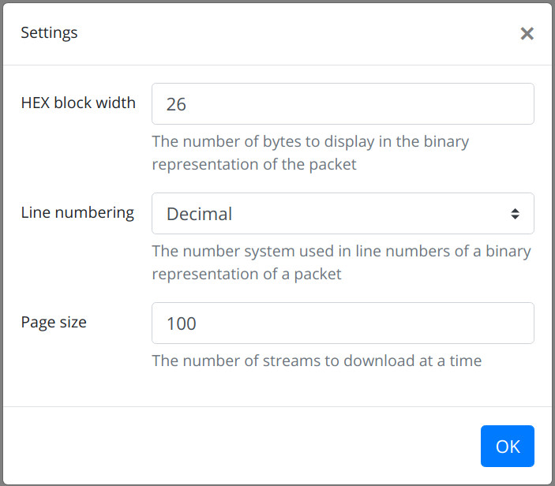
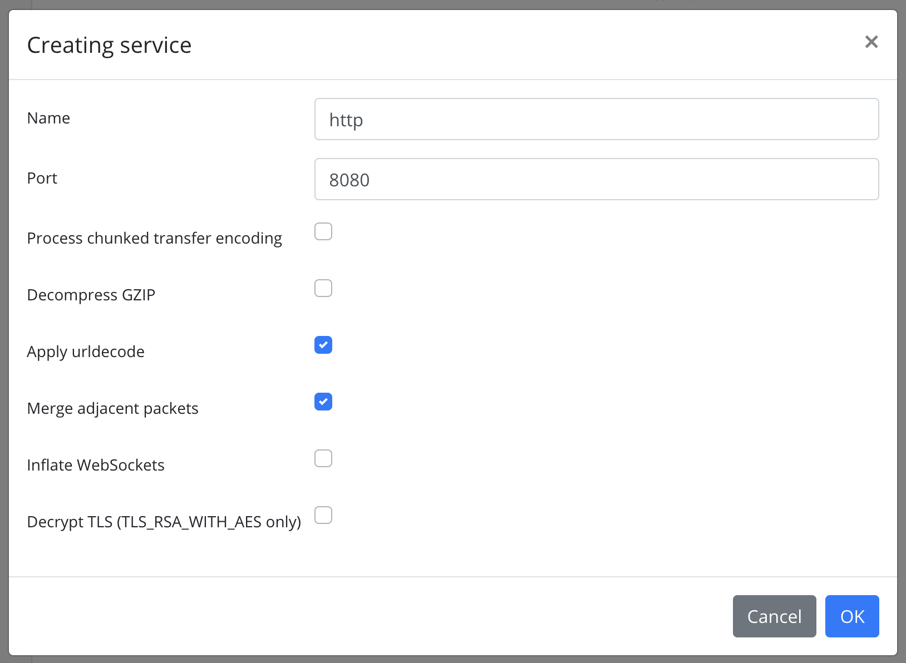
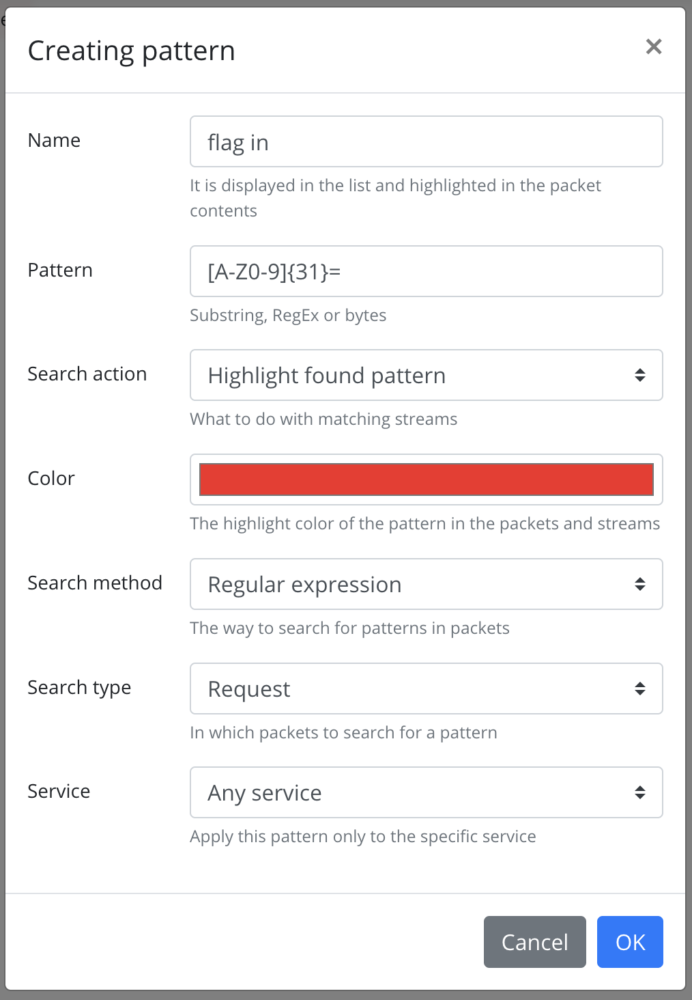
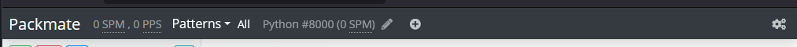
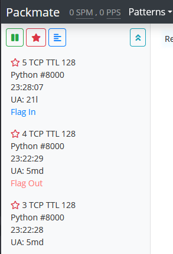
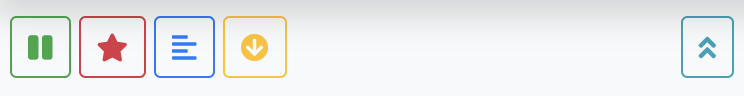
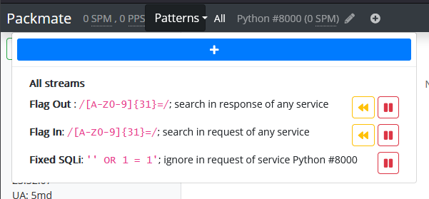

## Usage
### Settings
When attempting to access the web interface for the first time, your browser will prompt for a login and password, which were specified in the env file.  
If necessary, additional parameters can be configured via the gear icon in the top right corner of the screen.

### Creating Services
First, you need to create services that are present in the game. If you don't do this, no streams will be saved!
To do this, a dialog box is called by clicking the `+` button in the navbar,
where you can specify the name and port of the service, as well as additional options.

#### Service Parameters:
1. Name
2. Port (if the service uses multiple ports, you need to create a Packmate service for each port)
3. Chunked transfer encoding: automatically decode [chunked](https://developer.mozilla.org/en-US/docs/Web/HTTP/Headers/Transfer-Encoding#chunked_encoding) HTTP packets
4. Urldecode: automatically perform URL decoding of packets. Should be enabled by default for HTTP services.
5. Merge adjacent packets: automatically merge adjacent packets in the same direction. Should be enabled by default for non-binary services.
6. Inflate WebSockets: automatically decompress [compressed](https://www.rfc-editor.org/rfc/rfc7692) WebSocket packets.
7. Decrypt TLS: automatically decrypt TLS traffic (HTTPS). Only works with TLS_RSA_WITH_AES_* cipher suites and requires the private key used in the server's certificate (just like Wireshark).

### Creating Patterns
To conveniently capture exploits in the application, a pattern system exists.
To create a pattern, open the dropdown menu `Patterns` and click the `+` button,
then specify the pattern parameters and save.

Important: the pattern will only apply to streams captured after its creation. But you can use Lookback to analyze past streams.

#### Pattern Parameters:
1. Name: it will be displayed in the list on streams that contain this pattern.
2. Pattern: the content of the pattern itself. It can be a string, a regular expression, or a hex string depending on the pattern type.
3. Pattern ation:
   1. Highlight will highlight the found pattern. Example: searching for flags.
   2. Ignore will delete the stream containing this pattern.
      Example: you patched a service from a certain vulnerability and no longer want to see a specific exploit in the traffic. You can add this exploit as a pattern with IGNORE type, and it will no longer be saved.
4. Color: the color with which patterns of Highlight type will be highlighted.
5. Search method: substring, regular expression, binary substring
6. Search type: everywhere, only in requests, only in responses
7. Service: search in the traffic of all services or in a specific one.

### Game Start
In LIVE mode, the system will automatically capture streams and display them in the sidebar.
In FILE mode, click the corresponding button in the sidebar to start processing a file.
When you click on a stream in the main window, a list of packets is displayed;
you can switch between binary and text representation using the button in the sidebar.

### Navbar Overview

1. Title
2. SPM counter - Streams Per Minute
3. PPS counter - (average number of) Packets Per Stream
4. Button to open the list of patterns
5. List of services. In each service:
   1. Name
   2. Port
   3. SPM counter for the service - allows you to determine the most popular services
   4. Service edit button
6. Button to add a new service
7. Button to open settings

### Sidebar Overview

Tip: Sometimes during CTFs, admins forget to overwrite the TTL of packets inside the network. In such cases, you can differentiate requests from checkers and other teams based on TTL.

Tip #&#8203;2: User-Agent can be used to differentiate requests from different sources. For example, in the screenshot above, requests 4 and 5 may have come from different sources.

Tip #&#8203;3: Click on the star icon to add an interesting stream to your favorites. This stream will be highlighted in the list and will appear in the list of favorite streams.

#### Control Panel

1. Pause: Stop/resume displaying new streams on the screen. It does not stop intercepting streams or showing them to other users! Useful if streams are flying by too quickly.
2. Favorites: Show only streams marked as favorites.
3. Switch text/hexdump view.
4. Start analysis: Only appears when running in `FILE` mode.
5. Scroll stream list to the newest.

### Pattern Menu Overview

1. Add Pattern Button
2. Select All Streams (do not filter by pattern)
3. Pattern List. Each line contains:
   1. Pattern Description
   2. Lookback Button - applies the pattern to streams processed before the pattern creation.
   3. Pause - pattern cannot be deleted, but can be paused. It will not be applied to new streams after pausing.

Tip: Create separate patterns for incoming and outgoing flags to easily distinguish between flag checkers and exploits.

Tip #&#8203;2: Use Lookback to investigate discovered exploits.

Example: You found that the service just handed out a flag to user `abc123` without an apparent reason.
You can assume that the attacking team created this user and prepared an exploit in another stream.
But there is too much traffic in the game to manually find this stream.
Then you can create a `SUBSTRING` pattern with the value `abc123` and activate Lookback for a few minutes back.
After that, with the pattern filter enabled, only streams mentioning this user will be displayed.

### Hotkeys
Use the following hotkeys for quick navigation through streams:
* `Ctrl+Up` -- Move one stream up.
* `Ctrl+Down` -- Move one stream down.
* `Ctrl+Home` -- Go to the last stream.
* `Ctrl+End` -- Go to the first stream.